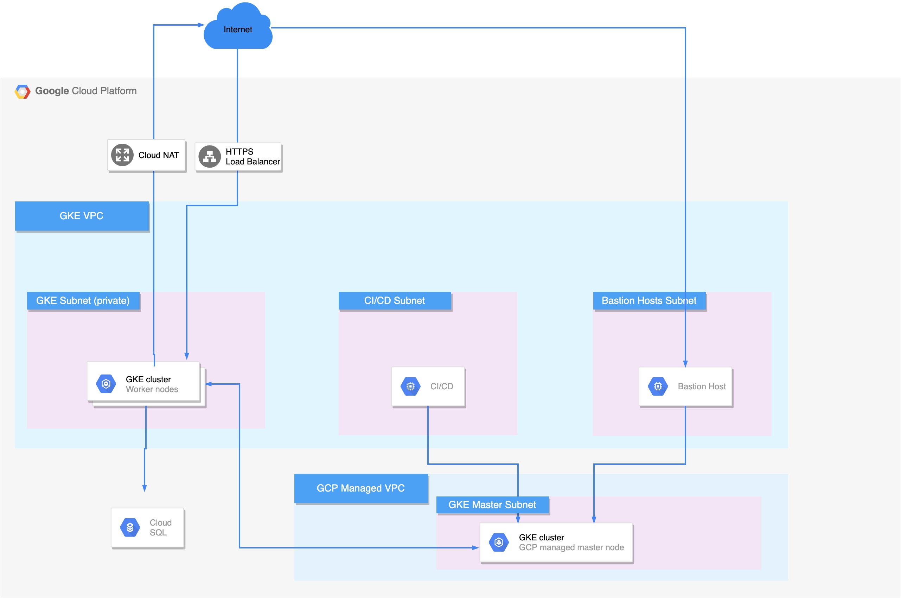

##  Infrastructure

### Architecture

### Pre-requisites 

- Install [Terraform](https://www.terraform.io/) version `0.12.0` or newer.
- Install [Terragrunt](https://github.com/gruntwork-io/terragrunt) version `v0.19.0` or newer.
- Install [Google Cloud SDK](https://cloud.google.com/sdk/) version `257.0.0` or newer.

### Prepare data:

- Replace dummy data at `inputs{}` sections with yours:
  - `./infrastructure/live/sample/terragrunt.hcl`: all inputs
  - `./infrastructure/live/sample/bastion-host/terragrunt.hcl`: `ssh_key`

### Deploy:

        # given you're at root level of repo
        cd ./infrastructure/live/sample
        # To verify plan before apply
        terragrunt plan-all
        # To create the infrastructure
        terragrunt apply-all
        # (and answer `y`)

### Access cluster:

- After deploying successfully, you will get 2 outputs: `instance_name` & `user`. 
- SSH to bastion host using `gcloud` CLI with 2 outputs above.

        gcloud compute ssh <user>@<instance_name>

- The `kubectl` tool & `kubeconfig` are already set up on bastion host. You can just start using it:

        kubectl get po --all-namespaces

### Clean up        

        # given you're at root level of repo
        cd ./infrastructure/live/sample
        # To destroy the infrastructure
        terragrunt destroy-all
        # (and answer `y`)

##  K8s cluster

### Set up cluster

Folder `./kustomize/init-cluster` contains 3 files to set up basic configuration for the cluster: namespaces, quotas, limits

## Application

Folder `./kustomize/app` contains yaml files to deploy an example application to be deployed to `dev` namespace of the cluster.

        cd ./kustomize/app
        kubectl apply -k kustomization-dev.yml
